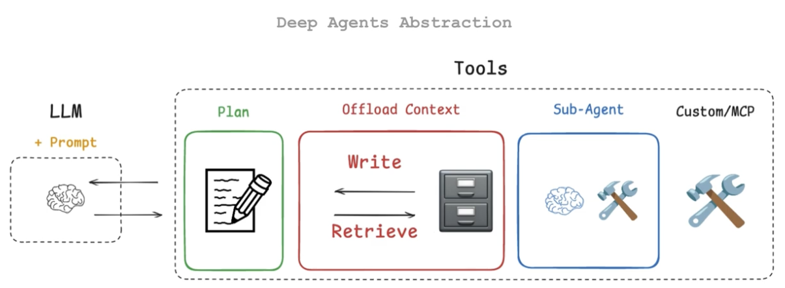

# Deep Agents

A "deep" agent is an AI system designed to autonomously execute complex, long-running tasks that unfold over many steps — often dozens or hundreds of tool calls — rather than answering a single question or performing a one-shot action. The term distinguishes these systems from simpler ReAct-style agents that operate in short loops. Deep agents behave more like junior engineers handed a project than assistants fielding a question: they plan, execute, adapt, and deliver.

Four principles define them:

1. **Planning as a first-class operation**. A deep agent doesn't just chain tool calls reactively. It begins by decomposing a task into a structured plan — often written out explicitly as a document or checklist — and then uses that plan as a living artifact to guide execution. The plan gets updated as the agent encounters new information or hits dead ends. This is what allows a deep agent to stay coherent across tasks that might involve 50+ steps where a naive loop would drift or lose track of its objective. The planning step is also where the agent reasons about dependencies and ordering, which feeds directly into the next principle.
2. **Offloading context to external storage**. LLM context windows are finite, and deep agents routinely generate more information than fits in one. Rather than trying to cram everything into the prompt, a deep agent treats the filesystem (or a scratchpad, database, etc.) as extended memory. It writes intermediate results, plans, notes, and state to files, then reads them back when needed. This is a fundamental architectural pattern — the agent's "working memory" lives outside the model. Without this, any task that spans more than a handful of steps collapses under context pressure, either from truncation or from the model losing track of earlier reasoning.
3. **Delegation and parallelization via subagents**. When a plan reveals independent subtasks, a deep agent can spawn child agents to handle them concurrently. Each subagent gets a scoped prompt, a narrow slice of the problem, and its own context — then reports results back to the orchestrator. This is where the architecture starts to resemble a manager coordinating a team rather than a single worker grinding through a queue. The orchestrator's job shifts toward synthesis, conflict resolution, and quality control across subagent outputs. This also helps with the context problem: each subagent operates in a clean, focused context window rather than inheriting the full accumulated state of the parent.
4. **Extensive prompt engineering as a requirement, not an option**. Deep agents are not plug-and-play. The system prompts, tool descriptions, planning prompts, delegation prompts, and error-recovery prompts all require significant iteration to get right. Small wording changes in a planning prompt can dramatically shift whether the agent decomposes tasks well or produces shallow, unhelpful plans. Tool descriptions need to be precise enough that the agent selects the right tool in ambiguous situations. Error-handling prompts need to balance persistence with knowing when to abandon a failing approach. This is fundamentally different from a chatbot where prompt engineering is nice-to-have — in a deep agent, it's structural. The prompts are the architecture in a meaningful sense.

The net effect is a system that can take on tasks like "refactor this codebase to use a new authentication pattern" or "research these 15 vendors and produce a comparison matrix" — tasks that require sustained, structured effort across many steps, with the agent managing its own state and work distribution along the way.